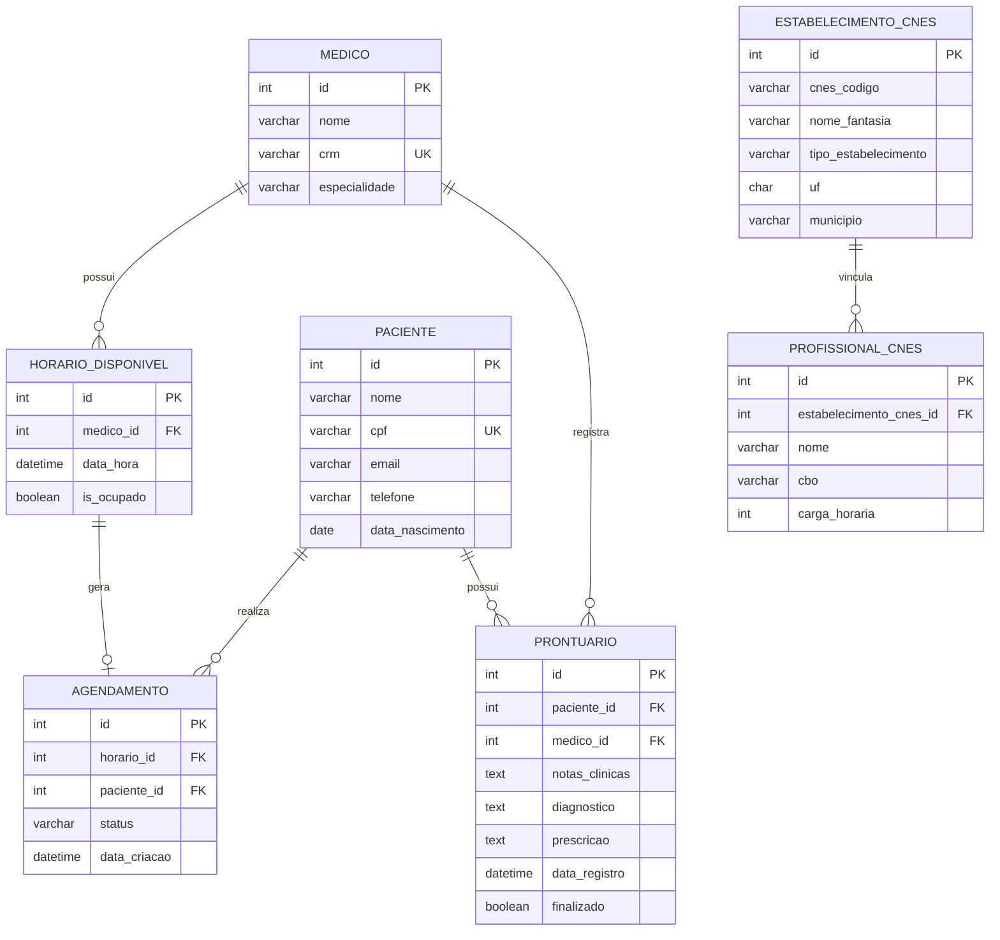

# Modelagem ER e Relações do BD

Este documento resume o modelo Entidade-Relacionamento, as relações e as tabelas/views criadas para a entrega de Banco de Dados do Prontuário Ágil.

## Modelo ER



## Relações

- `medico 1:N horario_disponivel`: um médico pode ter vários horários cadastrados.
- `horario_disponivel 1:0..1 agendamento`: um horário pode estar livre ou vinculado a um agendamento.
- `paciente 1:N agendamento`: um paciente pode realizar vários agendamentos.
- `paciente 1:N prontuario`: um paciente pode possuir vários registros clínicos.
- `medico 1:N prontuario`: um médico pode registrar vários prontuários.
- `estabelecimento_cnes 1:N profissional_cnes`: um estabelecimento público pode ter vários vínculos profissionais.

## Tabelas Criadas

| Tabela | Origem | Finalidade |
| --- | --- | --- |
| `medico` | Prontuário Ágil | Cadastro dos médicos da clínica. |
| `paciente` | Prontuário Ágil | Cadastro dos pacientes. |
| `horario_disponivel` | Prontuário Ágil | Agenda de horários dos médicos. |
| `agendamento` | Prontuário Ágil | Consultas marcadas entre pacientes e horários. |
| `prontuario` | Prontuário Ágil | Registros clínicos dos atendimentos. |
| `estabelecimento_cnes` | CNES/DataSUS | Estabelecimentos de saúde importados dos dados públicos. |
| `profissional_cnes` | CNES/DataSUS | Vínculos profissionais e carga horária por estabelecimento. |

## View Criada

```sql
CREATE OR REPLACE VIEW vw_estatisticas_especialidade AS
SELECT
    cbo AS especialidade,
    COUNT(*) AS total_profissionais,
    AVG(carga_horaria) AS media_carga_horaria,
    MAX(carga_horaria) AS max_carga_horaria,
    MIN(carga_horaria) AS min_carga_horaria,
    SUM(carga_horaria) AS soma_carga_horaria
FROM profissional_cnes
GROUP BY cbo;
```

A view `vw_estatisticas_especialidade` consolida os dados reais do CNES por CBO/especialidade e permite demonstrar funções estatísticas exigidas na atividade: `COUNT`, `AVG`, `MAX`, `MIN` e `SUM`.
