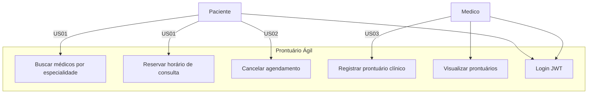
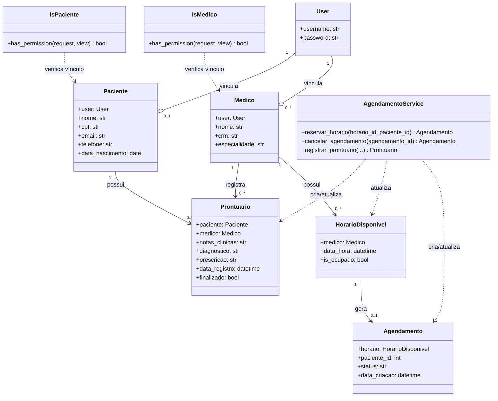
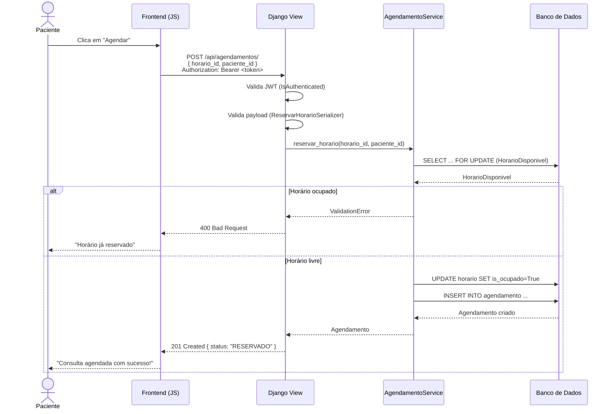
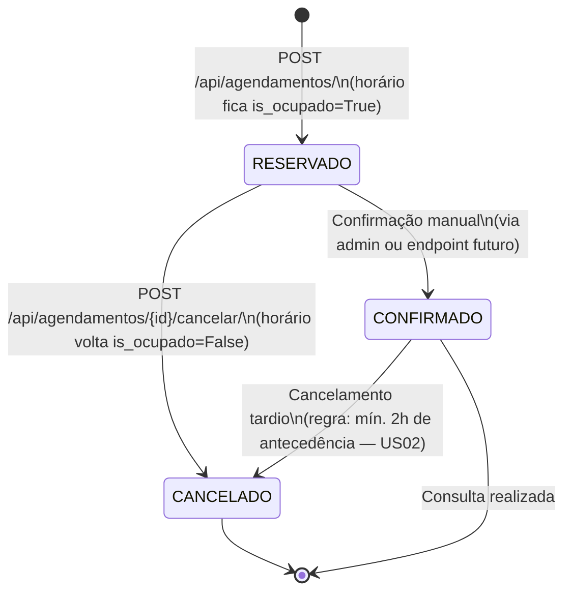

# Diagramas — Prontuário Ágil

Diagramas estruturais e comportamentais do sistema.

---

## Diagrama de Casos de Uso

---

## Diagrama de Classes

---

## Diagrama de Sequência — Reservar Horário (US01)

---

## Diagrama de Estados — Agendamento

---

## Diagrama ER (Banco de Dados)

Ver [`docs/bd-modelagem.md`](bd-modelagem.md) para o diagrama ER completo com as tabelas do domínio e as tabelas CNES/DataSUS.
